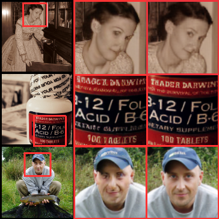
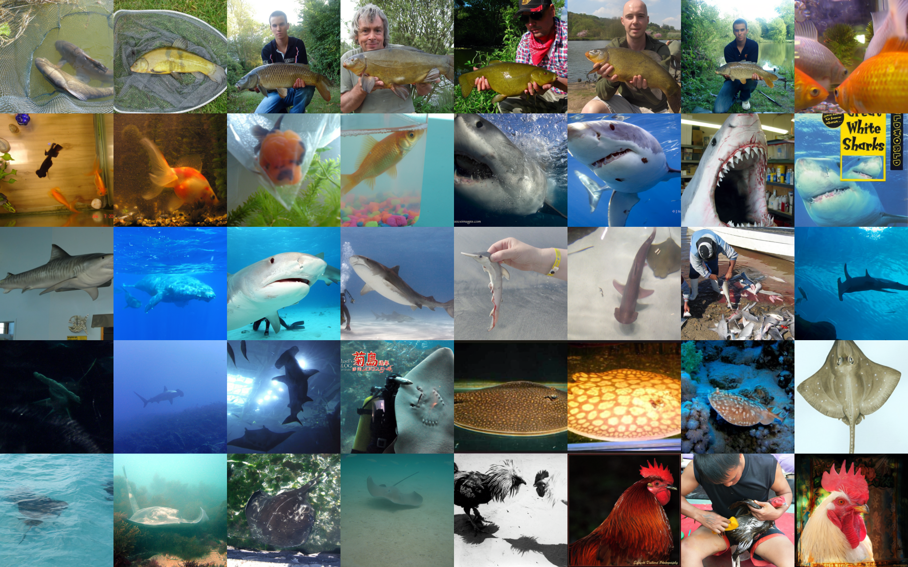
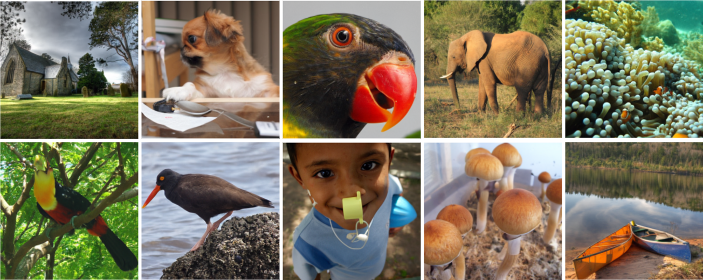

# Improving Image Details via Frequency-Aware Latent Optimization

> _A forked experimental project based on the original repository._  
> **Original README:** [README.md](docs/README_original.md)

---

## 1. Main Goal 
Modern latent generative models—especially two-stage diffusion and autoregressive frameworks—achieve strong performance in high-fidelity image synthesis, yet still struggle to preserve fine textures and sharp transitions. These missing details are largely tied to high-frequency information that is often lost during the latent compression stage.

The goal of this project is to explore how frequency information can be incorporated into latent representations to improve reconstruction quality and enhance downstream generation. By examining the frequency biases of existing state-of-the-art tokenizers and experimenting with frequency-aware designs, this project investigates whether improved high-frequency fidelity can lead to sharper, more realistic image synthesis in both diffusion-based and autoregressive models.

  

---

## 2. Main Results  
### **Reconstruction Results**

| Model (Tokenizer) | Recon. Loss ↓ | Low Freq. Loss ↓ | High Freq. Loss ↓ | LPIPS ↓ | rFID ↓ |
|-------------------|----------------|------------------|-------------------|---------|--------|
| KL-VAE ([MAR](https://github.com/LTH14/mar)) | 0.0148 | 0.0326 | 0.0089 | 0.1355 | 0.5310 |
| MS-VQ-VAE ([VAR](https://github.com/FoundationVision/VAR)) | 0.0195 | 0.0549 | 0.0076 | 0.1890 | 0.6981 |
| VA-VAE ([LightningDiT](https://github.com/hustvl/LightningDiT)) | 0.0105 | 0.0200 | 0.0074 | 0.0975 | 0.4884 |
| **FA-VAE (Ours)** | **0.0044** | **0.0114** | **0.0020** | **0.0940** | **0.4156** |

VA-VAE improves latent quality by aligning its latent space with foundation models (e.g., DINOv2), resulting in better overall reconstruction than VAE alternatives. However, these tokenizers still optimize all frequency components jointly, which limits their ability to recover sharp, high-frequency details—reflected in only modest improvements in high-frequency reconstruction error.

FA-VAE extends VA-VAE by explicitly separating low- and high-frequency components during training. This decoupled, frequency-aware optimization enables the model to learn compact latents that better preserve both global structure and fine textures. As a result, FA-VAE achieves the strongest performance across all metrics.

  

### **Generation Results**

| Tokenizer | Epochs | FID ↓ | IS ↑ | Pre. ↑ | Rec. ↑ | FID (CFG) ↓ | IS (CFG) ↑ | Pre. (CFG) ↑ | Rec. (CFG) ↑ |
|-----------|--------|-------|------|--------|--------|-------------|------------|--------------|--------------|
| VA-VAE    | 64     | 5.14  | 130.2 | 0.76 | 0.62 | 2.11 | 252.3 | 0.81 | 0.58 |
| FA-VAE    | 64     |  **3.24** | **193.7** | **0.83** | **0.69** | **1.32** | **317.4** | **0.83** | **0.65** |

We evaluate generative quality by training a diffusion-based image generator on top of the learned latent embeddings. Using LightningDiT (Yao, Yang, and Wang 2025) as the generative backbone, FA-VAE consistently improves generation metrics over the original VA-VAE tokenizer. Notably, FA-VAE yields lower gFID, higher IS, and stronger precision/recall, demonstrating that better frequency-preserving latents lead directly to sharper and more diverse generated samples. These improvements hold both with and without classifier-free guidance (CFG), indicating that the benefits stem from the latent representation itself rather than sampling tricks.

  

---

## 3. Approaches
- Model architecture
- Wavelet component
- Loss functions

---

## 4. Other Experiments & Problems 
- Metrics
- Experiments on LDM
- Experiments on VAR
- Mask Loss
- Problem Observation

---

## 5. Notes 
### **Code Structure**  
- Key directories
- Environment

### **Dataset: ImageNet Structure**
- Path structures  

---

## 6. Credits

This project builds upon the outstanding work of several open-source projects and research papers.  
Special thanks to the following repositories and authors:

- **LightningDiT** — [GitHub](https://github.com/hustvl/LightningDiT) · [Paper](https://arxiv.org/pdf/2501.01423)  
- **VAR** — [GitHub](https://github.com/FoundationVision/VAR) · [Paper](https://arxiv.org/pdf/2404.02905)  
- **MAR** — [GitHub](https://github.com/LTH14/mar) · [Paper](https://arxiv.org/abs/2406.11838)  
- **DiT** — [GitHub](https://github.com/facebookresearch/DiT) · [Paper](https://arxiv.org/pdf/2212.09748)  
- **LDM** — [GitHub](https://github.com/CompVis/latent-diffusion) · [Paper](https://arxiv.org/pdf/2112.10752)  
- **PyTorch Wavelets** — [GitHub](https://github.com/fbcotter/pytorch_wavelets)
